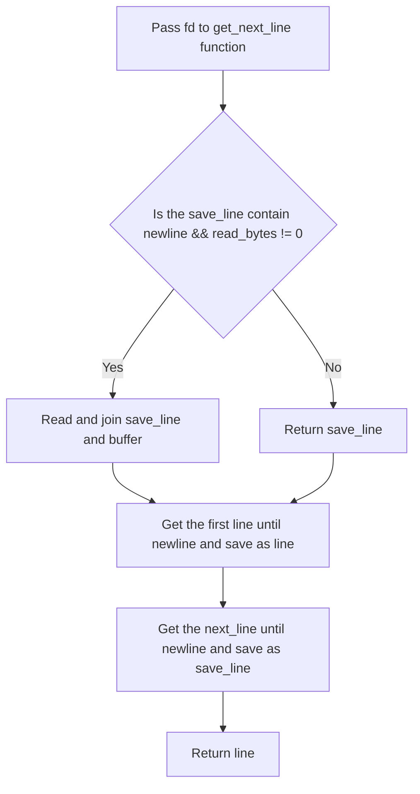

# get_next-line
The objective of this project is to create a function called ```get_next_line``` which allow you to read content line by line from a file descriptor . Calling it in a loop will read one line at a time until the end of the text.


# Terminology
Screenshot 2022-03-07 at 09.25.14
Screenshot 2022-03-07 at 09.56.33

# Key Point
- Functions open, read, close and buff size adaptation.
- Static variables to save line.
- Proper allocation and destruction of heap memory.
- Bonus: handling multiple file descriptors

# Flow Chart



## algorithms
1. check whether save_line has '\n' inside. On first run, save_line is null, ft_strchr not return a char and read_bytes is not 0 , so it will go into the while loop to read(). In the while loop, the buffer and save_line will be joined.
2. go to ft_get_line, to get the line while until the '\n'. Memory allocated until i + 2 as '\n' and '\0' is required to be added at the end of line.
3. go to ft_save, to remove the line from save_line in order to get the next read line. save the next line as save_line. if no more next line, function return null.

### Reference
1. [geeksforgeeks](https://www.geeksforgeeks.org/input-output-system-calls-c-create-open-close-read-write)
2. [/dev/tty](http://www.mit.edu/afs.new/athena/system/rhlinux/redhat-6.2-docs/HOWTOS/other-formats/html/Text-Terminal-HOWTO-html/Text-Terminal-HOWTO-6.html)
